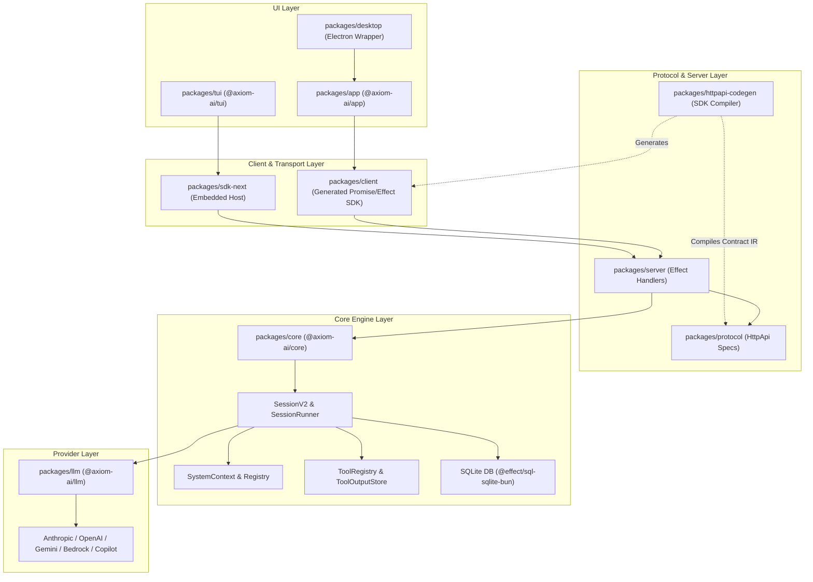
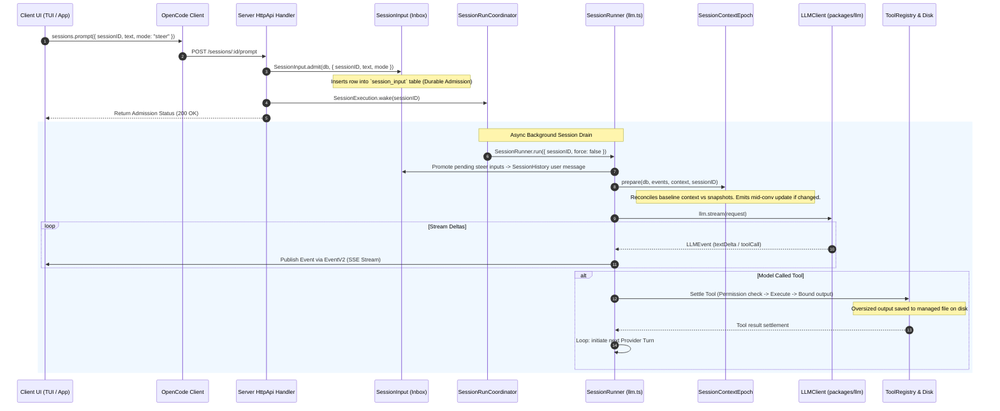
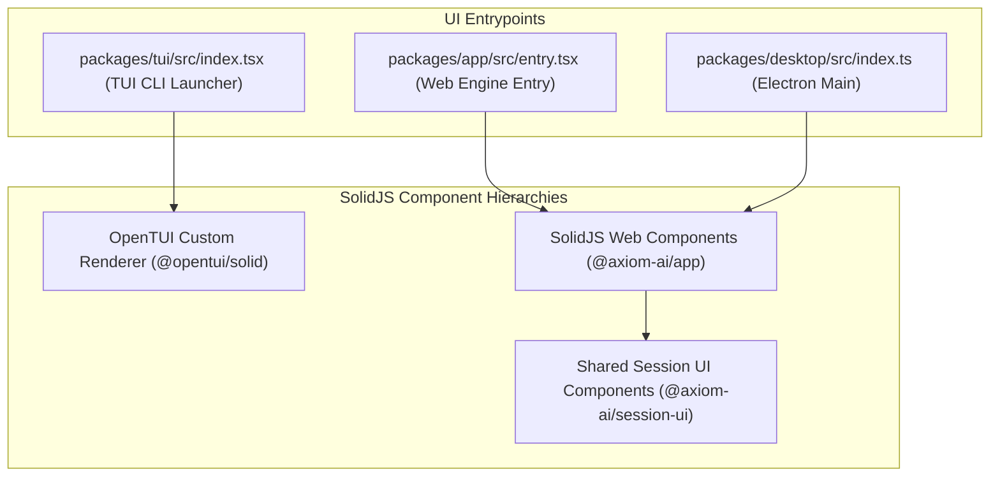

# OpenCode Architecture & Technical Deep-Dive

This document provides a comprehensive, end-to-end architectural breakdown of the OpenCode codebase. It is designed for developers studying the codebase to understand its design, inner mechanics, and patterns, or to build a similar AI-powered developer engine from scratch.

---

## Table of Contents
1. [Project Overview](#1-project-overview)
2. [High-Level Architecture](#2-high-level-architecture)
3. [Folder & File Structure](#3-folder--file-structure)
4. [Core Workflow / Execution Pipeline](#4-core-workflow--execution-pipeline)
5. [AI Agent Architecture](#5-ai-agent-architecture)
6. [UI Layer](#6-ui-layer)
7. [Editor Integration](#7-editor-integration)
8. [Data & State Management](#8-data--state-management)
9. [Extensibility / Plugin System](#9-extensibility--plugin-system)
10. [Build & Dev Tooling](#10-build--dev-tooling)
11. [Key Design Patterns](#11-key-design-patterns)
12. [Notable Gotchas / Non-obvious Design Decisions](#12-notable-gotchas--non-obvious-design-decisions)
13. [Reusable Patterns for a New IDE Project](#reusable-patterns-for-a-new-ide-project)

---

## 1. Project Overview

**OpenCode** is an open-source, AI-native software development tool and agentic IDE engine. It combines terminal interfaces (TUI), desktop GUI applications, and web clients with an autonomous backend agent engine capable of file editing, command execution, code search, session recovery, and multi-provider model orchestration.

### Core Value Proposition
- **Durable Session Execution**: Prompts and tool calls are persisted to SQLite BEFORE execution starts. Sessions survive process crashes, app restarts, or network disconnections without transcript loss.
- **Provider Caching & System Context Epochs**: Separates immutable system prompt baselines (which stay cached at the LLM provider level) from dynamic mid-conversation updates.
- **Protocol-First Microservices Architecture**: Decouples client applications from the engine using Effect `HttpApi` definitions. Embedded apps (TUI/Desktop) run the backend engine in-process via an in-memory HTTP router, while remote clients use the same generated API over network sockets.
- **Custom Terminal UI Engine (OpenTUI)**: Uses SolidJS components to render reactive terminal interfaces directly to ANSI buffer streams.

### Tech Stack & Key Libraries

| Category | Technology / Library | Version | Purpose |
| :--- | :--- | :--- | :--- |
| **Runtime & Package Manager** | Bun | `1.3.14` | Fast JavaScript runtime, package manager, workspace runner |
| **Language & Type System** | TypeScript | `5.8.2` | Strictly typed codebase with Effect schema inference |
| **Monorepo Build System** | Turborepo | `2.10.2` | Orchestrates multi-package builds and typechecking |
| **Effect Architecture** | `effect` | `4.0.0-beta.83` | Functional concurrency, dependency injection, fibers, schema parsing |
| **Database & ORM** | Drizzle ORM + `@effect/sql-sqlite-bun` | `1.0.0-rc.2` | Type-safe SQLite database access and schema migrations |
| **HTTP Server & Protocol** | `effect/unstable/httpapi` + Hono | `4.10.7` | Contract-driven HTTP API routing, middleware, SSE streaming |
| **AI Protocol Adapters** | Vercel `ai` SDK + `@ai-sdk/*` | `6.0.168` | Provider wire protocols (Anthropic, OpenAI, Gemini, Bedrock, Copilot) |
| **UI Framework (Web/App)** | SolidJS + `@solidjs/router` | `1.9.10` | Fine-grained reactive web application rendering |
| **Terminal Rendering** | `@opentui/solid` + `@opentui/core` | `0.4.5` | SolidJS renderer target for terminal ANSI buffer layout |
| **Desktop Container** | Electron + `electron-vite` | `42.3.3` | Native cross-platform desktop application packaging |
| **Terminal / PTY** | `@lydell/node-pty` | `1.2.0-beta.12` | Native pseudoterminal process management |
| **Syntax Highlighting** | Shiki + `@shikijs/stream` | `4.2.0` | Streaming code tokenization and HTML rendering |
| **Diff Rendering** | `@pierre/diffs` + `diff` | `1.2.10` | Visual git unified & side-by-side code diffs |

---

## 2. High-Level Architecture

OpenCode is designed around a **clean separation between API specification (`protocol`), core runtime engine (`core`), server hosting (`server`), generated SDK clients (`client`), and UI packages (`app`, `tui`, `desktop`)**.



### Communication Channels & IPC
1. **In-Memory Transport (Embedded Mode)**: `packages/sdk-next` runs an in-process host. When `packages/tui` or local desktop components make API calls, request objects pass directly through an in-memory Effect `HttpClient` to the server's Effect `HttpRouter` without network serialization.
2. **REST & Server-Sent Events (SSE) (Networked Mode)**: The server exposes standard HTTP endpoints (defined in `packages/protocol/src/api.ts`). Continuous streaming updates (message text deltas, tool statuses, execution state changes) are delivered over SSE via `sessions.events({ sessionID, after })`.
3. **PTY / Process Communication**: Pseudoterminal sessions run as child processes using `@lydell/node-pty`, bridged via Effect streams in `packages/core/src/pty.ts`.

---

## 3. Folder & File Structure

The monorepo uses Bun Workspaces managed under `packages/`. Below is a tour of the key packages and files.

```
opencode/
├── AGENTS.md                   # Repository engineering rules & code conventions
├── CONTEXT.md                  # Session runtime vocabulary & design spec
├── package.json                # Workspaces & monorepo catalog dependencies
├── turbo.json                  # Turborepo task pipeline configuration
└── packages/
    ├── app/                    # SolidJS Web Application source
    │   ├── src/app.tsx         # Main Web App entrypoint & routing
    │   └── package.json
    ├── cli/                    # Executable CLI bootstrapper (`lildax` / `opencode`)
    │   └── src/index.ts
    ├── client/                 # Generated Effect and Promise API Client
    │   ├── script/build.ts     # SDK generation script (`bun run generate`)
    │   ├── src/contract.ts     # Authoritative HttpApi configuration
    │   └── src/generated/      # Generated Promise client code
    ├── codemode/               # Standalone JSON schemas & contract fixtures
    ├── core/                   # Core Domain Engine & Execution Logic
    │   ├── src/
    │   │   ├── agent.ts        # Agent definition & configuration
    │   │   ├── catalog.ts      # Provider and model catalog definitions
    │   │   ├── database/       # SQLite connection setup & SQL migrations
    │   │   ├── event.ts        # Instance-wide and Session event bus
    │   │   ├── permission.ts   # Tool authorization & permission rules
    │   │   ├── pty.ts          # Terminal PTY management
    │   │   ├── session.ts      # SessionV2 high-level domain facade
    │   │   ├── session/        # Session execution subsystem (detailed below)
    │   │   │   ├── compaction.ts    # Auto-compaction & summarization
    │   │   │   ├── context-epoch.ts # Immutable baseline system context lifecycle
    │   │   │   ├── execution/       # Process-local execution router
    │   │   │   │   └── local.ts
    │   │   │   ├── history.ts       # History projection & cutoff calculations
    │   │   │   ├── input.ts         # Pending inbox (admit / promote)
    │   │   │   ├── run-coordinator.ts # Concurrent fiber synchronization
    │   │   │   ├── runner/
    │   │   │   │   ├── index.ts     # SessionRunner service contract
    │   │   │   │   └── llm.ts       # Provider turn loop & tool settlement
    │   │   │   └── sql.ts           # Drizzle database tables for session tables
    │   │   ├── system-context/ # Typed system context algebra & registry
    │   │   │   ├── index.ts     # SystemContext source composition algebra
    │   │   │   ├── registry.ts  # Location-scoped producer registry
    │   │   │   └── builtins.ts  # Built-in context sources (date, instructions)
    │   │   ├── tool/           # Core execution tools (edit, bash, read, etc.)
    │   │   └── tool-output-store.ts # Managed oversized tool output files
    ├── desktop/                # Electron wrapper package
    │   └── src/index.ts        # Electron main process entrypoint
    ├── httpapi-codegen/        # Compiler that converts HttpApi -> Promise & Effect SDKs
    │   └── src/index.ts
    ├── llm/                    # LLM protocol adapters & wire encoders
    │   └── src/
    │       ├── llm.ts          # Core LLMClient contract
    │       └── protocols/      # Anthropic, OpenAI, Gemini, Bedrock adapters
    ├── plugin/                 # Plugin loader & lifecycle hooks
    ├── protocol/               # Master HttpApi endpoint definitions
    │   └── src/
    │       ├── api.ts          # Assembled HttpApi definition
    │       └── groups/         # Endpoint definitions (session, message, fs, etc.)
    ├── schema/                 # Shared domain schemas & identifier brands
    ├── sdk-next/               # Embedded OpenCode in-process host
    ├── server/                 # Effect HTTP route handlers & middleware
    │   └── src/
    │       ├── handlers/       # Endpoint handlers delegating to Core
    │       └── routes.ts       # Assembled Effect HttpRouter
    ├── session-ui/             # Shared SolidJS components for chat UI & diffs
    ├── tui/                    # Terminal UI package powered by OpenTUI
    │   └── src/
    │       ├── index.tsx       # Main TUI bootstrapper
    │       └── runtime.tsx     # OpenTUI rendering tree initialization
    └── ui/                     # Shared UI component design system (buttons, modals, icons)
```

---

## 4. Core Workflow / Execution Pipeline

When a user submits a prompt in an OpenCode interface (TUI, Web, or Desktop), the request flows through a step-by-step pipeline from the UI to the AI provider and back.



### Trace of Key Code Functions Involved

1. **User Submission**: The UI calls `client.sessions.prompt({ sessionID, prompt })`.
2. **Durable Admission**:
   - File: [`packages/core/src/session/input.ts`](file:///d:/Open_Code/opencode/packages/core/src/session/input.ts)
   - Function: `SessionInput.admit(db, input)`
   - *Action*: Inserts a new row into SQLite table `session_input`. The prompt is durably saved before any execution starts.
3. **Execution Wakeup**:
   - File: [`packages/core/src/session/execution/local.ts`](file:///d:/Open_Code/opencode/packages/core/src/session/execution/local.ts)
   - Function: `SessionExecution.wake(sessionID)`
   - *Action*: Triggers `SessionRunCoordinator.wake(sessionID)` to join or start a process-local fiber drain.
4. **Prompt Promotion**:
   - File: [`packages/core/src/session/runner/llm.ts`](file:///d:/Open_Code/opencode/packages/core/src/session/runner/llm.ts)
   - Function: `SessionRunner.run({ sessionID, force })`
   - *Action*: Promotes pending input rows into model-visible user messages inside `SessionHistory`.
5. **System Context Preparation**:
   - File: [`packages/core/src/session/context-epoch.ts`](file:///d:/Open_Code/opencode/packages/core/src/session/context-epoch.ts)
   - Function: `SessionContextEpoch.prepare(db, events, context, sessionID)`
   - *Action*: Compares the active baseline system context against current environment context. If dynamic values (e.g. `AGENTS.md`) changed, it publishes a `Mid-Conversation System Message` without invalidating the immutable baseline.
6. **Model Stream Execution**:
   - File: [`packages/core/src/session/runner/llm.ts`](file:///d:/Open_Code/opencode/packages/core/src/session/runner/llm.ts)
   - Function: `llm.stream(request)`
   - *Action*: Invokes `@axiom-ai/llm` stream adapter. Streams text deltas and tool calls.
7. **Tool Settlement & Output Bounding**:
   - File: [`packages/core/src/tool/registry.ts`](file:///d:/Open_Code/opencode/packages/core/src/tool/registry.ts) and [`packages/core/src/tool-output-store.ts`](file:///d:/Open_Code/opencode/packages/core/src/tool-output-store.ts)
   - Function: `ToolRegistry.settle(...)` and `ToolOutputStore.write(...)`
   - *Action*: Checks permissions via `PermissionV2`, executes the requested operation (e.g., file edit or terminal command), bounds output size, writes oversized output to disk, records settlement in SQLite, and restarts the turn loop.

---

## 5. AI Agent Architecture

### System Context Algebra & Context Epochs
OpenCode uses a formal algebra for system instructions to maximize **LLM Prompt Caching**.

```typescript
// From packages/core/src/system-context/index.ts
export interface Source<A> {
  readonly key: string
  readonly load: Effect.Effect<A | typeof unavailable>
  readonly compare: (a: A, b: A) => boolean
  readonly encode: (a: A) => unknown
  readonly decode: (json: unknown) => A
  readonly renderBaseline: (a: A) => string
  readonly renderUpdate: (previous: A, current: A) => string | undefined
  readonly renderRemoval?: (previous: A) => string | undefined
}
```

- **Baseline System Context**: Rendered once at the start of a **Context Epoch** and retained verbatim in SQLite (`session_context_epoch` table). This string remains completely static to ensure provider prompt cache hits.
- **Mid-Conversation System Messages**: When instructions change mid-conversation (e.g. user modifies `AGENTS.md`), OpenCode renders a short incremental update message inserted at the safe provider-turn boundary instead of re-rendering the full system prompt.

### Context Compaction & Summarization
When total session history tokens exceed provider context limits, `SessionCompaction` automatically truncates old turns and invokes an LLM summarization turn.

```typescript
// From packages/core/src/session/compaction.ts
const SUMMARY_TEMPLATE = `
## Objective
- [one or two brief sentences describing what the user is trying to accomplish]

## Important Details
- [constraints/preferences, decisions and why, context needed]

## Work State
### Completed
- [finished work]
### Active
- [current work]
### Blocked
- [blockers]

## Next Move
1. [immediate concrete action]
`
```

The output summary replaces old raw history, starting a new **Context Epoch** with a fresh baseline system context.

### Model Provider Abstraction (`packages/llm`)
OpenCode abstracts all LLM APIs behind a unified `LLMClient` interface:
- **`protocols/anthropic-messages.ts`**: Formats messages for Anthropic API, handles prompt caching control headers (`cache_control`).
- **`protocols/openai-chat.ts`**: Translates tools and structured inputs into OpenAI `chat/completions` payload.
- **`protocols/gemini.ts`**: Formats Google Gemini requests and handles Gemini tool schemas.
- **`protocols/bedrock-converse.ts`**: Connects to AWS Bedrock Converse API.

---

## 6. UI Layer

OpenCode offers three primary UI interfaces built with SolidJS:



### 1. Web Application (`packages/app`)
- **Framework**: SolidJS (`solid-js@1.9.10`), Solid Router (`@solidjs/router`), TailwindCSS v4, Kobalte UI (`@kobalte/core`).
- **State Management**: SolidJS signals (`createSignal`, `createStore`) paired with TanStack Solid Query (`@tanstack/solid-query`).

### 2. Desktop Application (`packages/desktop`)
- **Framework**: Electron (`electron@42.3.3`) wrapping `packages/app`.
- **Packaging**: `electron-vite` for bundling, `electron-builder` for multi-platform installers.
- **Native Integration**: Directly links native binary node bindings for terminal PTY support (`@lydell/node-pty`).

### 3. Terminal UI (`packages/tui`) — OpenTUI Engine
- **Framework**: OpenTUI (`@opentui/solid`, `@opentui/core`).
- **Mechanics**: Instead of React Ink or Blessed, OpenTUI uses a custom SolidJS reconciler target that compiles reactive JSX primitives (`<box>`, `<text>`, `<scrollview>`) directly into an ANSI terminal screen buffer tree with flexbox-like terminal layout math.

---

## 7. Editor Integration

### Code Tokenization & Syntax Highlighting
- File: [`packages/session-ui/src/components/markdown-stream.ts`](file:///d:/Open_Code/opencode/packages/session-ui/src/components/markdown-stream.ts)
- Engine: Shiki (`shiki@4.2.0`) combined with `@shikijs/stream`. Tokenizes code blocks incrementally as text streams in from LLM responses without full-page re-renders.

### Code Diffing
- File: [`packages/session-ui/src/pierre/index.ts`](file:///d:/Open_Code/opencode/packages/session-ui/src/pierre/index.ts)
- Engine: `@pierre/diffs` combined with `diff`. Visualizes multi-file code modifications inline or side-by-side with collapsible context chunks and syntax highlighting.

### Embedded Terminal Renderer
- Engine: `ghostty-web` (a web assembly terminal renderer built from Ghostty) and `node-pty`. Provides full terminal emulation inside Web and Desktop UI panels.

---

## 8. Data & State Management

All domain state is stored locally in an embedded SQLite database using **Effect Drizzle ORM** (`@effect/sql-sqlite-bun` / `packages/effect-drizzle-sqlite`).

### SQLite Schema (`packages/core/src/session/sql.ts`)

```typescript
// Session Table
export const SessionTable = sqliteTable("session", {
  id: text().primaryKey(),
  project_id: text().notNull(),
  workspace_id: text().notNull(),
  agent: text().notNull(),
  location: text().notNull(),
  created_at: integer().notNull(),
  updated_at: integer().notNull(),
})

// Session Message Table
export const SessionMessageTable = sqliteTable("session_message", {
  id: text().primaryKey(),
  session_id: text().notNull(),
  seq: integer().notNull(),
  type: text().notNull(), // 'user' | 'assistant' | 'system' | 'compaction'
  data: text({ mode: "json" }).notNull(),
  created_at: integer().notNull(),
})

// Session Context Epoch Baseline Table
export const SessionContextEpochTable = sqliteTable("session_context_epoch", {
  session_id: text().primaryKey(),
  baseline_seq: integer().notNull(),
  baseline: text().notNull(),
  snapshot: text({ mode: "json" }).notNull(),
})

// Session Input Inbox Table
export const SessionInputTable = sqliteTable("session_input", {
  id: text().primaryKey(),
  session_id: text().notNull(),
  mode: text().notNull(), // 'steer' | 'queue'
  data: text({ mode: "json" }).notNull(),
})
```

---

## 9. Extensibility / Plugin System

OpenCode implements a modular plugin system defined in `packages/plugin` and managed in `packages/core/src/plugin.ts`.

### Plugin Capabilities
1. **Custom Context Sources**: Plugins can register new `ContextSource` producers into the `SystemContextRegistry` to feed custom environment details into the LLM context.
2. **Custom Tools**: Tools are registered via `ToolRegistry.Service`. Each tool specifies its JSON input schema, permission requirements, and execution effect.
3. **Location-Based Instructions (`AGENTS.md`)**: Discovers workspace or global `AGENTS.md` instruction files automatically, injecting them into context at safe turn boundaries.

### Permission Engine (`packages/core/src/permission.ts`)
Before any tool executes an effectful operation (e.g. bash execution, file modification), it checks `PermissionV2.Service`.
- Can prompt the user interactively (via HTTP question request).
- Remembers user approvals (per-session or per-workspace) persisted in SQLite.

---

## 10. Build & Dev Tooling

### Workspace Orchestration & Scripts
- **Monorepo Manager**: Bun Workspaces + Turborepo (`turbo.json`).
- **Main Dev Script**: `bun run dev` (runs `packages/opencode`).
- **Desktop Dev Script**: `bun run dev:desktop` (runs `electron-vite dev`).

### API Code Generator (`packages/httpapi-codegen`)
OpenCode uses a custom code generator to maintain total type safety between backend Effect services and frontend clients:

```bash
# Executed from packages/client to regenerate SDK targets
bun run generate
```

1. Reads the authoritative `ClientApi` spec from `packages/protocol/src/api.ts`.
2. Compiles an in-memory **SDK Contract IR** (Intermediate Representation).
3. Generates two target outputs:
   - **`packages/client/src/generated`**: A zero-dependency Promise-based client using standard `fetch` and async iterables.
   - **`packages/client/src/generated-effect`**: A rich Effect-native client that preserves Effect schemas, brands, and streams.

---

## 11. Key Design Patterns

### 1. Decoupled Service Layer via Effect TS Dependency Injection
All services (Database, SessionStore, LLMClient, ToolRegistry) are declared using Effect `Context.Service` tags and constructed via `Layer`.

```typescript
// Example from packages/core/src/session/store.ts
export class Service extends Context.Service<Service, Interface>()("@opencode/v2/SessionStore") {}

export const node = makeGlobalNode({
  service: Service,
  layer,
  deps: [Database.node],
})
```

### 2. Durable Inbox (Admit & Advisory Wake)
Separates the **durability constraint** from the **execution constraint**. Prompts are durably saved to disk (`SessionInput.admit`), and an advisory signal (`SessionExecution.wake`) triggers execution. If the process crashes mid-wake, post-crash recovery can simply scan `session_input` and resume without losing user inputs.

### 3. Session Run Coordinator (`run-coordinator.ts`)
Concurrently runs different sessions on separate Effect fibers while guaranteeing that prompts for the *same* session are serialized sequentially without race conditions.

```typescript
// From packages/core/src/session/run-coordinator.ts
export interface Coordinator<Key, E> {
  readonly active: Effect.Effect<ReadonlySet<Key>>
  readonly run: (key: Key) => Effect.Effect<void, E>
  readonly wake: (key: Key) => Effect.Effect<void>
  readonly interrupt: (key: Key) => Effect.Effect<void>
}
```

---

## 12. Notable Gotchas / Non-obvious Design Decisions

1. **OpenTUI Solid Renderer in Terminal**: OpenCode does not build terminal UIs with string concatenation or Ink. It runs SolidJS reactivity directly inside terminal ANSI buffers using `@opentui/solid`.
2. **Same Router for Embedded and Remote Clients**: `packages/sdk-next` runs `packages/server` handlers in-process via an in-memory `HttpClient`. There is zero network serialization overhead when running locally, yet the exact same code runs over HTTP SSE for remote setups.
3. **Managed Tool Output Files**: LLM tool calls (like reading a 50MB log file) could instantly corrupt or inflate SQLite session histories. OpenCode previews tool text in SQLite history while storing full oversized outputs as flat files on disk (`packages/core/src/tool-output-store.ts`).
4. **Single Provider Call per Turn**: OpenCode explicitly avoids delegating multi-step tool loops to vendor SDKs (e.g. LangChain or Vercel AI SDK tool loop). OpenCode performs **one explicit provider call per turn**, reloads projected history, checks pending inbox steer prompts, and explicitly decides whether to run another turn.

---

## Reusable Patterns for a New IDE Project

If you are building your own AI developer engine or agent framework from scratch, here are the top 7 architectural lessons to copy from OpenCode:

1. **Adopt Contract-Driven API Generation**: Define your API once in a protocol spec (`packages/protocol`) and compile both Promise and Effect/Stream SDKs automatically using a codegen compiler (`packages/httpapi-codegen`).
2. **Implement Durable Input Admission**: Always save user inputs to database tables (`session_input`) *before* waking up LLM execution loops.
3. **Use Immutable System Context Epochs**: Separate static system prompts (for LLM prompt caching) from dynamic mid-conversation updates to prevent unnecessary cache invalidation.
4. **Enforce Single Turn Execution Loops**: Maintain control of your agent's execution loop instead of delegating orchestration to opaque vendor tool loops.
5. **Offload Large Tool Outputs to File Storage**: Save raw, large tool outputs to temporary managed files on disk while storing only bounded previews in session history.
6. **Decouple UI Components from Host Runtime**: Build UI components using universal frameworks (like SolidJS) so they can run unchanged across Web, Desktop (Electron), and Terminal (OpenTUI) environments.
7. **Serialize Concurrent Work with Process-Local Coordinators**: Prevent state corruption by using key-based fiber coordinators (`SessionRunCoordinator`) to serialize execution per session while running multiple sessions concurrently.
