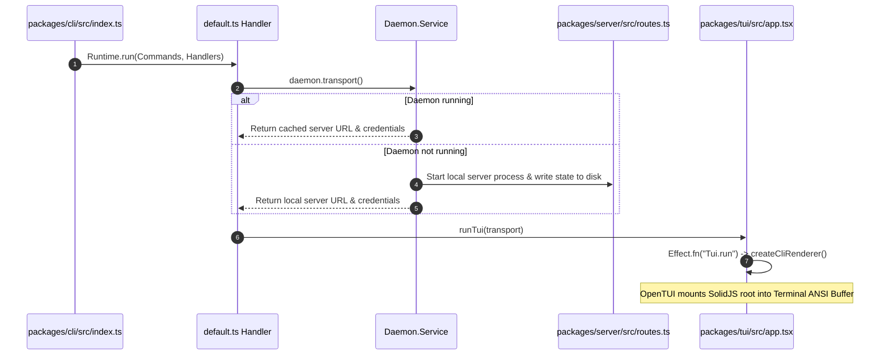
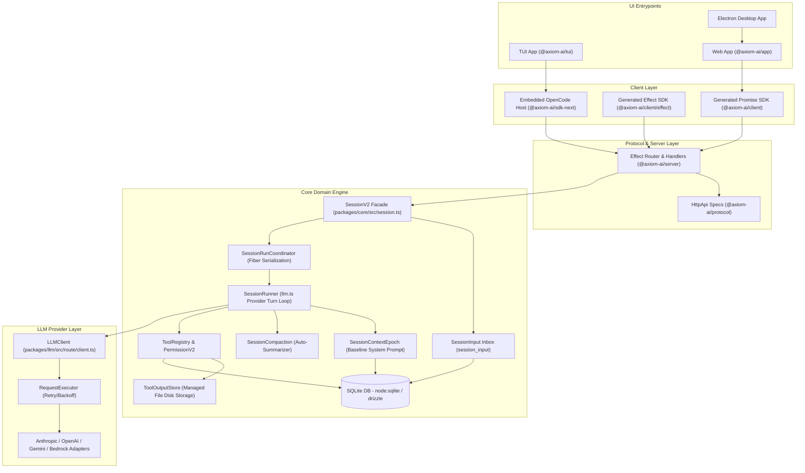
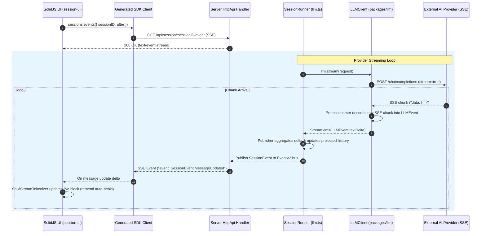

# OpenCode Deep Logic & Execution Mechanics Architecture

This document provides a deep logic-level breakdown of the OpenCode codebase. It explains the exact algorithms, data flows, state transitions, concurrency mechanisms, and error recovery strategies used across the system, supported by real code snippets and file references.

---

## Table of Contents
1. [Project Overview & Startup Sequence](#1-project-overview--startup-sequence)
2. [High-Level Architecture & Data Flow Diagram](#2-high-level-architecture--data-flow-diagram)
3. [Streaming Logic (Deep Dive)](#3-streaming-logic-deep-dive)
4. [Session Management (Deep Dive)](#4-session-management-deep-dive)
5. [Agent & Tool-Calling Logic](#5-agent--tool-calling-logic)
6. [Context & Prompt Construction Logic](#6-context--prompt-construction-logic)
7. [State Management (UI Side)](#7-state-management-ui-side)
8. [IPC & Process Communication Logic](#8-ipc--process-communication-logic)
9. [File & Folder Structure Map](#9-file--folder-structure-map)
10. [Config & Provider Abstraction](#10-config--provider-abstraction)
11. [Error Handling & Retry Logic](#11-error-handling--retry-logic)
12. [Notable Gotchas & Non-obvious Tricks](#12-notable-gotchas--non-obvious-tricks)
13. [Reusable Patterns for a New IDE Project (Local LLM / Ollama Focus)](#13-reusable-patterns-for-a-new-ide-project-local-llm--ollama-focus)

---

## 1. Project Overview & Startup Sequence

**OpenCode** is an AI-powered software development environment and engine. It can run as an interactive Terminal UI (TUI), a Desktop GUI (Electron), an in-browser Web App, or a headless daemon server.

### Tech Stack & Exact Versions
- **Runtime**: Bun `1.3.14`
- **Language**: TypeScript `5.8.2`
- **Monorepo Manager**: Turborepo `2.10.2`
- **Core Framework**: Effect TS `4.0.0-beta.83`
- **Database & ORM**: Drizzle ORM `1.0.0-rc.2` + SQLite (`@effect/sql-sqlite-bun` / `node:sqlite`)
- **HTTP Server**: Effect `HttpApi` (`effect/unstable/httpapi`) + Hono `4.10.7`
- **AI SDK / Protocols**: Vercel `ai` `6.0.168` + custom provider protocol adapters in `@axiom-ai/llm`
- **UI Framework**: SolidJS `1.9.10` + `@solidjs/router` `0.15.4` + Tailwind CSS `4.1.11`
- **Terminal Engine**: OpenTUI (`@opentui/solid` `0.4.5`, `@opentui/core` `0.4.5`)
- **Desktop Host**: Electron `42.3.3` + `electron-vite` `5.x`
- **Terminal PTY**: `@lydell/node-pty` `1.2.0-beta.12`

### Boot Sequence (Step-by-Step)



1. **CLI Launch**: Executing `opencode` invokes [`packages/cli/src/index.ts`](file:///d:/Open_Code/opencode/packages/cli/src/index.ts#L1-L32). NodeRuntime boots Effect services (`NodeServices.layer`, `Daemon.layer`).
2. **Command Routing**: `Runtime.handlers` matches the default command in [`packages/cli/src/commands/handlers/default.ts`](file:///d:/Open_Code/opencode/packages/cli/src/commands/handlers/default.ts#L6-L13).
3. **Daemon Discovery**: `Daemon.Service` checks `Global.Path.state` for an active server process. If inactive, it spawns a background server instance (`packages/server/src/routes.ts`).
4. **Transport Connection**: `daemon.transport()` resolves `http://127.0.0.1:<port>` and authentication credentials.
5. **TUI Initialization**: [`packages/cli/src/tui.ts`](file:///d:/Open_Code/opencode/packages/cli/src/tui.ts#L7-L19) calls `run(...)` in [`packages/tui/src/app.tsx`](file:///d:/Open_Code/opencode/packages/tui/src/app.tsx#L186). OpenTUI initializes a `CliRenderer` that mounts the reactive SolidJS component tree into ANSI screen buffers.

---

## 2. High-Level Architecture & Data Flow Diagram



---

## 3. Streaming Logic (Deep Dive)

### End-to-End Streaming Trace



### Transport & Stream-Reading Loop
OpenCode uses **Server-Sent Events (SSE)** for streaming. 

1. **Protocol Definition**: Defined in [`packages/protocol/src/groups/session.ts`](file:///d:/Open_Code/opencode/packages/protocol/src/groups/session.ts#L327-L342) using `HttpApiSchema.StreamSse({ data: SessionEvent.Durable })`.
2. **Server Handler**: In [`packages/server/src/handlers/session.ts`](file:///d:/Open_Code/opencode/packages/server/src/handlers/session.ts#L358-L364), the server returns an Effect stream converted to SSE.
3. **Core Stream Consumer**: In [`packages/core/src/session/runner/llm.ts`](file:///d:/Open_Code/opencode/packages/core/src/session/runner/llm.ts#L232-L275), `llm.stream(request)` returns an Effect stream processed using `Stream.runForEach`:

```typescript
// packages/core/src/session/runner/llm.ts:232-243
const providerStream = llm.stream(request).pipe(
  Stream.runForEach((event) =>
    Effect.gen(function* () {
      if (overflowFailure || publisher.hasProviderError()) return
      if (LLMEvent.is.providerError(event)) {
        if (isContextOverflowFailure(event) && !publisher.hasAssistantStarted()) {
          overflowFailure = event
          return
        }
      }
      yield* publish(event)
      if (event.type !== "tool-call" || event.providerExecuted) return
      // Tool settlement execution...
    }),
  ),
)
```

### Partial Tokens Parsing & Incremental UI Rendering (Zero Flickering)
To prevent DOM flickering during text streaming, [`packages/session-ui/src/components/markdown-stream.ts`](file:///d:/Open_Code/opencode/packages/session-ui/src/components/markdown-stream.ts#L53-L86) implements a **live block projection algorithm**:

1. **Auto-Healing Incomplete Markdown**: Uses `remend` (`remend(text, { linkMode: "text-only" })`) to repair incomplete markdown syntax (unclosed links, unclosed bold tags, incomplete lists) while the token stream is active.
2. **Block Splitting**: Splits incoming text into completed blocks (`mode: "full"` or `mode: "code"`) and active trailing blocks (`mode: "live"`).
3. **Shiki Code Tokenization**: Completed code blocks are tokenized once by Shiki and cached, while only the active streaming code tail updates incrementally.

```typescript
// packages/session-ui/src/components/markdown-stream.ts:53-86
export function stream(text: string, live: boolean): Block[] {
  if (!live) return completedProjection(text).blocks
  if (refs(text)) return [{ raw: text, src: heal(text), mode: "live" }] satisfies Block[]
  const tokens = marked.lexer(text)
  const tail = tokens.findLastIndex((token) => token.type !== "space")
  if (tail < 0) return [{ raw: text, src: heal(text), mode: "live" }] satisfies Block[]
  const last = tokens[tail]

  const result: Block[] = []
  for (let index = 0; index < tail; index++) {
    const token = tokens[index]
    if (!token || token.type === "space") continue
    let raw = token.raw
    while (tokens[index + 1]?.type === "space" && index + 1 < tail) raw += tokens[++index]!.raw
    if (token.type === "code") {
      const code = token as Tokens.Code
      result.push({ raw, src: code.text, mode: "code", language: language(code.lang), complete: true })
      continue
    }
    result.push({ raw, src: raw, mode: "full" })
  }

  const raw = tokens.slice(tail).map((token) => token.raw).join("")
  if (last.type !== "code") return [...result, { raw, src: heal(raw), mode: "live" }]
  const code = last as Tokens.Code
  if (!open(code.raw))
    return [...result, { raw, src: code.text, mode: "code", language: language(code.lang), complete: true }]
  return [...result, { raw, src: openCode(code.raw), mode: "code", language: language(code.lang) }]
}
```

### Stream Interruption & Cancellation
Stream cancellation is managed via `sessions.interrupt({ sessionID })` in [`packages/core/src/session.ts`](file:///d:/Open_Code/opencode/packages/core/src/session.ts#L415-L425). 
- `SessionExecution.interrupt(sessionID)` delegates to `SessionRunCoordinator.interrupt(key)` in [`packages/core/src/session/run-coordinator.ts`](file:///d:/Open_Code/opencode/packages/core/src/session/run-coordinator.ts#L94-L101).
- `SessionRunCoordinator` flags `entry.stopping = true` and invokes `Fiber.interrupt(entry.owner)`, immediately terminating the running provider fiber stream.

```typescript
// packages/core/src/session/run-coordinator.ts:94-101
const interrupt = (key: Key): Effect.Effect<void> =>
  Effect.suspend(() => {
    const entry = active.get(key)
    if (entry?.owner === undefined) return Effect.void
    entry.stopping = true
    entry.pendingWake = false
    return Fiber.interrupt(entry.owner)
  })
```

### Disconnection Recovery (Sequence-Based Replay)
If the SSE transport drops, the generated client reconnects by calling `sessions.events({ sessionID, after: lastObservedSeq })` ([`packages/protocol/src/groups/session.ts`](file:///d:/Open_Code/opencode/packages/protocol/src/groups/session.ts#L327-L342)).
The server queries SQLite for events matching `session_id = :sessionID AND seq > :after` and replays all missed durable events in sequence before resuming live event broadcast.

---

## 4. Session Management (Deep Dive)

### Data Schema (`packages/core/src/session/sql.ts`)

```typescript
// packages/core/src/session/sql.ts:8-37
export const SessionTable = sqliteTable("session", {
  id: text().$type<SessionSchema.ID>().primaryKey(),
  project_id: text().$type<ProjectV2.ID>().notNull(),
  workspace_id: text().$type<WorkspaceV2.ID>().notNull(),
  directory: text().$type<AbsolutePath>().notNull(),
  title: text().notNull(),
  cost: real().notNull().$default(() => 0),
  tokens_input: integer().notNull().$default(() => 0),
  tokens_output: integer().notNull().$default(() => 0),
  agent: text().$type<AgentV2.ID>().notNull(),
  model: text({ mode: "json" }).$type<ModelV2.Ref>().notNull(),
  location: text().$type<Location.Ref>().notNull(),
  time_created: integer().notNull().$default(() => Date.now()),
  time_updated: integer().notNull().$default(() => Date.now()),
})

// packages/core/src/session/sql.ts:140-155
export const SessionInputTable = sqliteTable("session_input", {
  id: text().$type<SessionMessage.ID>().primaryKey(),
  session_id: text().$type<SessionSchema.ID>().notNull().references(() => SessionTable.id, { onDelete: "cascade" }),
  prompt: text({ mode: "json" }).$type<Prompt>().notNull(),
  delivery: text().$type<SessionInput.Delivery>().notNull(), // 'steer' | 'queue'
  admitted_seq: integer().notNull(),
  promoted_seq: integer(),
  time_created: integer().notNull().$default(() => Date.now()),
})
```

### Read/Write Operations & Session Persistence
Session mutation functions reside in [`packages/core/src/session/store.ts`](file:///d:/Open_Code/opencode/packages/core/src/session/store.ts) and [`packages/core/src/session/input.ts`](file:///d:/Open_Code/opencode/packages/core/src/session/input.ts).

```typescript
// packages/core/src/session/input.ts:41-62
export const admit = Effect.fn("SessionInput.admit")(function* (
  db: DatabaseService,
  events: EventV2.Interface,
  input: {
    readonly id: SessionMessage.ID
    readonly sessionID: SessionSchema.ID
    readonly prompt: Prompt
    readonly delivery: Delivery
  },
) {
  const existing = yield* find(db, input.id)
  if (existing !== undefined) return existing
  const timestamp = yield* DateTime.now
  return yield* events
    .publish(SessionEvent.PromptAdmitted, {
      messageID: input.id,
      sessionID: input.sessionID,
      timestamp,
      prompt: input.prompt,
      delivery: input.delivery,
    })
    // Inserts row into session_input table...
})
```

### Context Compaction Logic
When session token count approaches model limits, `SessionCompaction` ([`packages/core/src/session/compaction.ts`](file:///d:/Open_Code/opencode/packages/core/src/session/compaction.ts#L225-L236)) automatically summarizes history:

```typescript
// packages/core/src/session/compaction.ts:225-236
const compactIfNeeded = Effect.fn("SessionCompaction.compactIfNeeded")(function* (input: Input) {
  if (!config.auto) return false
  const context = input.model.route.defaults.limits?.context
  if (context === undefined || context <= 0) return false
  const output = input.request.generation?.maxTokens ?? input.model.route.defaults.limits?.output ?? 0
  if (
    estimate({ system: input.request.system, messages: input.request.messages, tools: input.request.tools }) <=
    context - Math.max(output, config.buffer)
  )
    return false
  return yield* compactAfterOverflow(input)
})
```

Summarization produces structured XML/Markdown sections:
- `## Objective`
- `## Important Details`
- `## Work State` (`Completed`, `Active`, `Blocked`)
- `## Next Move`
- `## Relevant Files`

Old session history prior to the compaction boundary is archived, and a new **Context Epoch** begins with the output summary as the new baseline context.

### Multi-Session Isolation
Different active sessions run on independent Effect fibers coordinated by `SessionRunCoordinator` ([`packages/core/src/session/run-coordinator.ts`](file:///d:/Open_Code/opencode/packages/core/src/session/run-coordinator.ts#L28)). The coordinator maintains a `Map<Key, Entry<E>>` where key is `SessionSchema.ID`. Multiple sessions execute concurrently across CPU cores without shared mutable state.

---

## 5. Agent & Tool-Calling Logic

### The Agentic Turn Loop

```typescript
// Pseudocode extracted from packages/core/src/session/runner/llm.ts:383-406
while (shouldRun) {
  let needsContinuation = true
  let step = 1
  while (needsContinuation) {
    // 1. Promote pending input (steer/queue)
    // 2. Prepare SystemContext & ContextEpoch
    // 3. Construct LLMRequest & execute llm.stream(request)
    const result = yield* runTurn(input.sessionID, promotion, step)
    
    // 4. Stream tokens & materialise tool-call events
    // 5. Execute tool settlements in parallel FiberSet
    needsContinuation = result.needsContinuation
    step = result.step + 1
    
    if (!needsContinuation) {
      needsContinuation = yield* SessionInput.hasPending(db, input.sessionID, "steer")
    }
  }
  shouldRun = yield* SessionInput.hasPending(db, input.sessionID, "queue")
}
```

### Parallel Tool Execution during Streaming
When `LLMEvent.toolCall` events arrive during stream decoding, OpenCode spawns concurrent execution fibers inside a `FiberSet` ([`packages/core/src/session/runner/llm.ts`](file:///d:/Open_Code/opencode/packages/core/src/session/runner/llm.ts#L250-L272)):

```typescript
// packages/core/src/session/runner/llm.ts:250-272
yield* Effect.uninterruptibleMask((restore) =>
  restore(
    toolMaterialization.settle({
      sessionID: session.id,
      agent: agent.id,
      assistantMessageID,
      call: event,
    }),
  ).pipe(
    Effect.flatMap((settlement) =>
      publish(
        LLMEvent.toolResult({
          id: event.id,
          name: event.name,
          result: settlement.result,
          output: settlement.output,
        }),
        settlement.outputPaths ?? [],
      ),
    ),
  ),
).pipe(FiberSet.run(toolFibers))
```

### Tool Error Surfacing
If a tool throws an exception or fails permission checks, `settle` catches the failure and constructs a `SessionMessage.ToolStateError` object:

```typescript
{
  status: "error",
  error: { message: "Permission denied: bash command execution is disabled" }
}
```

This error payload is published as `LLMEvent.toolResult` and stored in SQLite history. On the subsequent provider turn loop, the LLM reads this tool error result as context, enabling autonomous error correction.

---

## 6. Context & Prompt Construction Logic

### Assembly Sequence
Before calling `llm.stream(request)`, `SessionRunner` assembles the prompt payload in the following order:

1. **Baseline System Context**: Loaded from `SessionContextEpochTable` (`session_context_epoch`), containing static project metadata, OS info, and baseline rules.
2. **Mid-Conversation System Messages**: Incremental context update messages emitted when ambient files (e.g. `AGENTS.md`) change.
3. **Compaction Summary**: Summarized conversation history up to the latest compaction cutoff.
4. **Projected Session History**: Chronological sequence of user messages, assistant responses, and tool results post-compaction.
5. **Promoted User Message**: Newly admitted steer or queue prompt.
6. **Active Tool Definitions**: Encoded JSON schemas of tools registered in `ToolRegistry`.

---

## 7. State Management (UI Side)

### Fine-Grained SolidJS Reactivity
The UI uses SolidJS fine-grained signals (`createSignal`, `createStore`) and TanStack Solid Query (`@tanstack/solid-query`).

When text deltas arrive over SSE, the stream handler updates SolidJS store nodes directly:

```typescript
// Conceptual example from packages/session-ui/src/context/session.tsx
setStore("messages", messageIndex, "content", partIndex, "text", (prev) => prev + delta)
```

Because SolidJS uses signal-based fine-grained dependency tracking instead of VDOM re-rendering, only the specific DOM text node bound to the active message part updates when a delta arrives.

---

## 8. IPC & Process Communication Logic

### Electron Desktop IPC (`packages/desktop`)
- **Preload Interface**: [`packages/desktop/src/preload/index.ts`](file:///d:/Open_Code/opencode/packages/desktop/src/preload/index.ts) exposes IPC bridges via Electron `contextBridge`:
  ```typescript
  contextBridge.exposeInMainWorld("electron", {
    ipcRenderer: {
      send: (channel, data) => ipcRenderer.send(channel, data),
      on: (channel, func) => ipcRenderer.on(channel, (event, ...args) => func(...args)),
      invoke: (channel, data) => ipcRenderer.invoke(channel, data),
    }
  })
  ```
- **Main Channels**:
  - `server:url`: Fetches active backend server URL and credentials.
  - `desktop:menu`: Handles native window frame operations and updates.

### Embedded OpenCode In-Process Router Host (`packages/sdk-next`)
In TUI or embedded desktop mode, OpenCode avoids network IPC entirely. `packages/sdk-next/src/opencode.ts` mounts server routes directly into an in-memory web handler (`HttpRouter.toWebHandler`) and provides a custom `fetch` transport that routes request objects directly to Effect handlers in memory.

---

## 9. File & Folder Structure Map

```
opencode/
├── packages/
│   ├── app/                # SolidJS Web Application
│   ├── cli/                # Executable CLI launcher (`lildax` / `opencode`)
│   ├── client/             # Generated Promise & Effect SDK clients
│   ├── core/               # Main engine (SessionV2, SystemContext, Tools)
│   ├── desktop/            # Electron desktop container
│   ├── httpapi-codegen/    # HttpApi SDK code generator
│   ├── llm/                # LLM protocol adapters (Anthropic, OpenAI, etc.)
│   ├── plugin/             # Plugin loader & lifecycle system
│   ├── protocol/           # Authoritative Effect HttpApi schema definitions
│   ├── schema/             # Shared domain data types & identifier brands
│   ├── sdk-next/           # Embedded OpenCode in-process host
│   ├── server/             # Effect HTTP server handlers & router
│   ├── session-ui/         # Markdown, code diff, and prompt UI components
│   ├── tui/                # OpenTUI SolidJS terminal UI engine
│   └── ui/                 # Shared UI design system components
```

---

## 10. Config & Provider Abstraction

All LLM providers implement the `LLMClient` interface in [`packages/llm/src/llm.ts`](file:///d:/Open_Code/opencode/packages/llm/src/llm.ts).

```typescript
// packages/llm/src/llm.ts
export interface Interface {
  readonly stream: (request: LLMRequest) => Stream.Stream<LLMEvent, LLMError>
  readonly generate: (request: LLMRequest) => Effect.Effect<LLMResponse, LLMError>
}
```

Provider implementations in `packages/llm/src/providers/` (e.g. `anthropic.ts`, `openai.ts`, `google.ts`, `openai-compatible.ts`) convert model parameters, tool schemas, and header credentials into unified request formats.

---

## 11. Error Handling & Retry Logic

### HTTP Request Retry & Backoff (`packages/llm/src/route/executor.ts`)
The LLM request executor implements exponential backoff retries with random jitter for transient errors:

```typescript
// packages/llm/src/route/executor.ts:35-38
const MAX_RETRIES = 2
const BASE_DELAY_MS = 500
const MAX_DELAY_MS = 10_000

// Retryable HTTP status codes
const retryableStatus = (status: number) => 
  status === 429 || status === 503 || status === 504 || status === 529
```

The executor parses `Retry-After` or `retry-after-ms` headers from rate-limited responses and delays subsequent retry attempts accordingly.

### Context Overflow Recovery
If an LLM API call fails with a context overflow error (`isContextOverflowFailure(event)`), `SessionRunner` catches the failure before assistant generation starts and automatically triggers `compactAfterOverflow`, summarizing prior turns and retrying the request with a fresh baseline system context.

---

## 12. Notable Gotchas & Non-obvious Tricks

1. **Remend Auto-Healing Markdown**: Incomplete markdown tokens streamed over SSE are dynamically repaired using `remend` to prevent UI layout breakage.
2. **Managed Tool Output Files**: Oversized tool output (e.g., a 100MB log file output from `bash`) is stripped from SQLite history and saved to disk as a `Managed Tool Output File` ([`packages/core/src/tool-output-store.ts`](file:///d:/Open_Code/opencode/packages/core/src/tool-output-store.ts)), leaving only a bounded preview in the message log.
3. **OpenTUI Renderer**: The terminal interface does not use React Ink or string concatenation. It uses `@opentui/solid`, running SolidJS reactivity directly inside ANSI screen buffer objects.
4. **Single-Turn Provider Loops**: OpenCode avoids opaque vendor tool loops. It runs one explicit provider turn (`llm.stream`), materializes tool calls into parallel fibers, records settlements, and explicitly checks for pending steer prompts before starting the next turn.

---

## 13. Reusable Patterns for a New IDE Project (Local LLM / Ollama Focus)

If you are building an **Electron + Node/TS + Ollama** powered AI IDE from scratch, here are the core patterns to adapt from OpenCode:

### 1. Adapt Durable Input Admission
Always persist user prompt inputs to SQLite (`session_input`) *before* triggering model generation. If Ollama crashes or experiences an out-of-memory (OOM) event during inference, the application can recover the prompt state on restart.

### 2. Implement Aggressive Local Context Compaction
Local models (e.g. Llama 3 or Qwen on Ollama) usually operate with limited context windows (e.g., 8k or 16k tokens). Adopt OpenCode's `SessionCompaction` pattern with a smaller buffer (e.g. 2,000 tokens) to automatically summarize conversation histories before local context limits are breached.

### 3. Native In-Process Host Architecture
Follow OpenCode's `sdk-next` pattern: package your backend services using an in-memory HTTP router (`HttpRouter.toWebHandler`) so your Electron application can run local backend logic in-process without spawning external network HTTP servers.

### 4. Parallel Tool Execution in Stream Loops
Adopt OpenCode's `FiberSet` pattern: as tool call blocks stream in from Ollama, spawn execution promises/fibers concurrently and await their settlements before initiating the next LLM turn.
